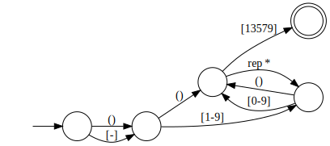

# Reregex, yet another minimal regex implementation

Many standard regex features are supported, such as non-greedy matching (e.g. `.*?`), character set ranges (`[a-z]`), alternations (`(a|bb)+`), and graphviz dot-formatted NFA-like diagrams.

Capture groups, Lookarounds and Unicode-aware features are not supported. The engine ins't particularly fast either.


## Example: Visualize regex

```bash
cargo run --example dot -- '-?([1-9][0-9]*)?[13579]' > odd.dot
dot -Tpng odd.dot > odd.png
```



## Example: Grep

```bash
cat README.md | cargo run --example grep -- '`[^`]+`'
```
